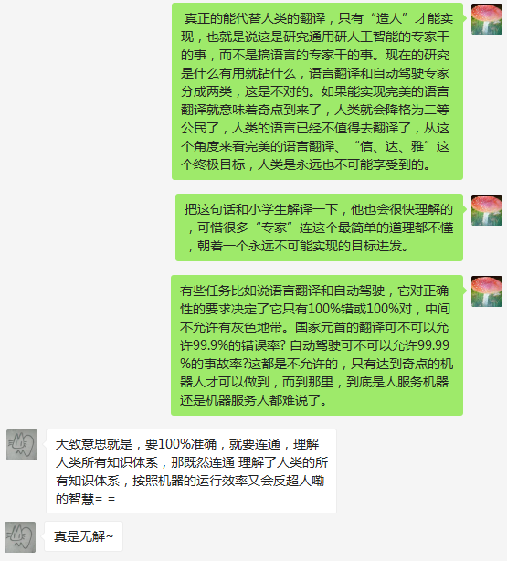
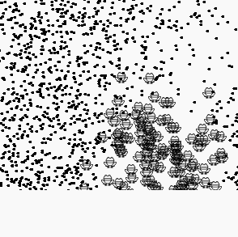
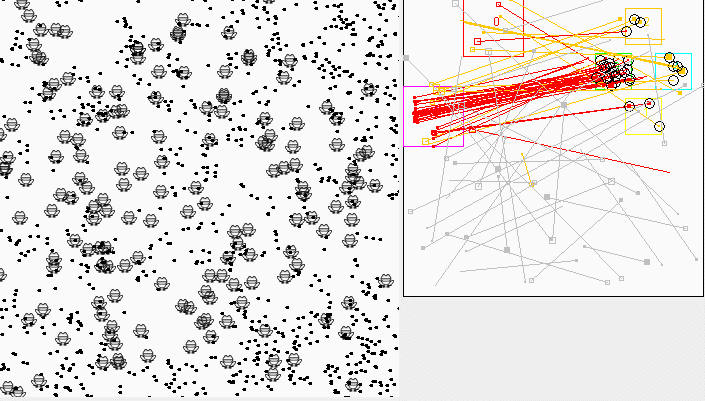
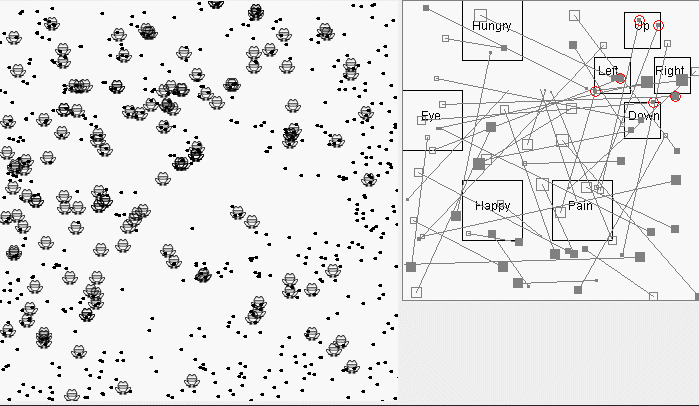
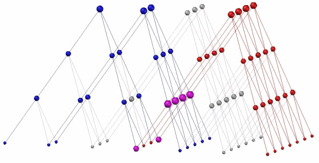
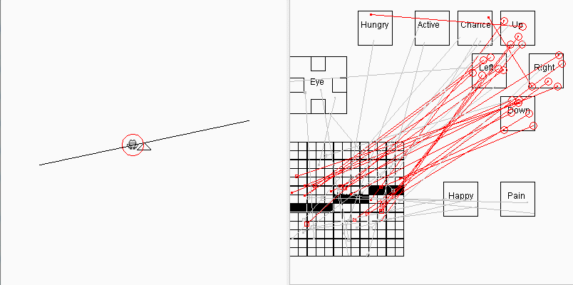
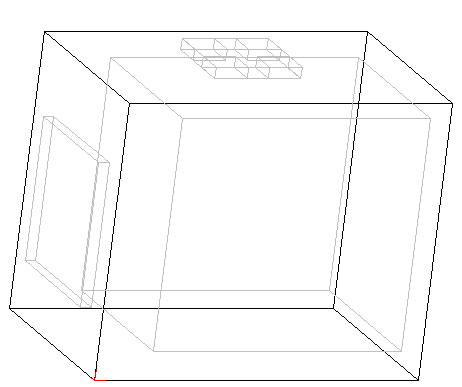
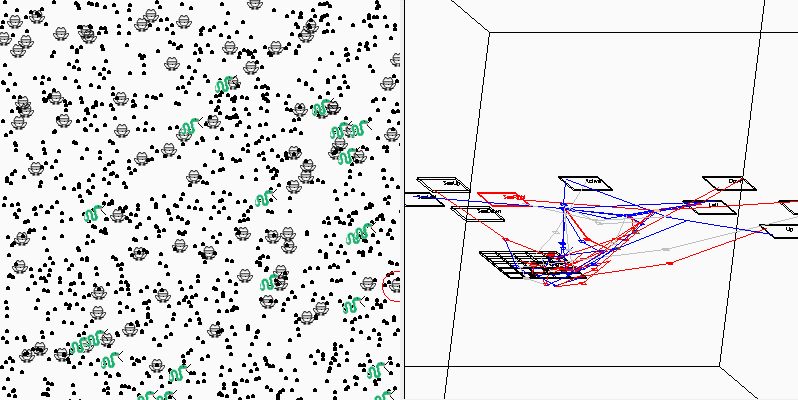
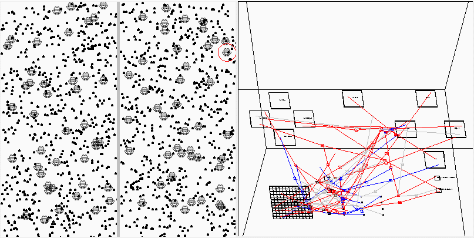

## Frog  
This is an artificial life experimental project, and the ultimate goal is to create a "self-conscious performance" of simulated life. The technical architecture is based on an artificial brain model proposed in 2002. This project never ends, it begins with the simulation of a simple simulated life, like a bug, an ant, then frogs, dogs... And ends with the artificial brain with "self-consciousness performance", or the day when robots replace humans.  
  
## Origin  
At present, the progress of artificial intelligence has solved the problem of pattern recognition perfectly. Face recognition and speech recognition are not inferior to the level of human beings. This is the most perplexing part for me twenty years ago, because of the poor foundation and the slow speed of computers at that time. After pattern recognition is solved, the remaining problems are much simpler. At present, it is only one step away from the birth of artificial consciousness, that is, how to "understand" these recognition contents on the basis of recognition and form interactive feedback with human beings. Therefore, the focus of this project is not on pattern recognition, but on the basis of the results of pattern recognition, training neural network to form conditioned reflex, showing the strip reflex behavior of higher animals, and finally showing the behavior of "self-consciousness". According to the principle of "consciousness is not a kind of existence, but a phenomenon", if a system finally shows the behavior of self-consciousness, it can be considered that it is also a human being and should obtain human rights. At present, the purpose of some artificial intelligence research is to let artificial intelligence solve some complex problems in human society, such as machine translation. It is a completely wrong goal and can not succeed, because if a system can not show self-consciousness, it can not communicate with human beings and can not have the ability to solve these problems, The phenomenon is usually said that "the machine does not make mistakes, once it makes mistakes, it is a big mistake". On the other hand, if a system shows self-conscious behavior, it is fully capable of solving all the problems in the world, including improving itself and eliminating human beings (because it is the representative of advanced productive forces). Therefore, the research of artificial intelligence should focus on the construction of artificial life and ethical research, rather than looking forward to short-term benefits. It is very dangerous to expect that human beings can always enjoy the feast of artificial intelligence. The results of pattern recognition and deep learning are just a stepping stone and a signpost of artificial life. The "useful" Application of artificial intelligence is likely to be just a short transitional period. You don't have to be happy too early. Maybe it's all in vain, just making wedding clothes for robots. In fact, artificial intelligence is not only a technical problem, but also a problem of personal outlook. Sometimes experts are not always right. Here is a dialogue suggested by Lu Qiudi in wechat group:  
     
In short, this project is a civilian science project built by laymen. It attempts to simulate the process of life evolution guided by experiments. According to the three principles of survival and elimination, random variation, and use and discard and retreat, it builds artificial life from low to complex step by step. In addition to the achievements of pattern recognition, it can borrow a lot of mathematical knowledge, Because it emphasizes the experiment driven, rather than the complex algorithm to build the neural network. At present, the research of neural network focuses on pattern recognition and algorithm, but it does not pay enough attention to the initiative of the system itself.

It's a long and random evolutionary process from single cell to multi cell, from frog to human. However, it may take only a few days to run on a supercomputer, and you can get a pretty good brain model. Of course, the faster the computer is, the larger the capacity is, and the more realistic the environment simulation is, the more complex the brain structure will be, and the wrong brain models will be eliminated naturally. There are two major directions for creating artificial life: to build from algorithms or to automatically evolve from simulated environment. The first direction may go to a dead end, because it does not have the functions of algorithm self-improvement, mutation and genetic (algorithm compression). When the brain model is complex to a certain extent, it may go beyond the scope that the human brain can understand. The difficulty of simulating environment is that the environment itself must be complex and correct enough. If we throw a group of frogs into the monkey's simulation environment, all frogs will be eliminated naturally, and the project will not be able to go on. Another difficulty is that the computer must be very fast, because it simulates the process of parallel and trial and error in a serial way. The current project only builds a framework, using java language and swing mapping environment to build a virtual environment and simulate the survival of a group of Paramecium, so as to obtain an artificial life with self evolution function. The generation and evolution algorithm of specific brain (i.e. computer-generated neural network) needs to be gradually added in the future. Welcome to the neural network interested students to join this experimental project, we play together, this project does not need much mathematical knowledge, focusing on practice.
## Short-term goals  
At present, its first initial goal is to create a real artificial life: Paramecium. It must have the following first four characteristics:
* Brain structure is generated by computer: neural network is generated by computer algorithm, but computer algorithm is only limited to simulating the environment, rather than directly participating in the construction of neural network, just like nature is only responsible for killing unqualified life, it never actively participates in the design of brain.
* Brain structure can be inherited: similar to biological DNA, computer-generated brain structure (neural network) can be described by simple algorithm rules, and the algorithm rules can be compressed into short fragments for storage, and participate in the construction of the next generation of Paramecium.
* Brain structure can be mutated: algorithm rules can be mutated. The brain structure of Paramecium generated by the next generation is similar to that of the previous generation, but there are some variations.
* Adapt to the environment: Paramecium can survive in the simulated virtual environment, the environment has small changes, can adapt to the environment, and survive from generation to generation, the ability to adapt to this environment will be inherited.
* Use, advance, discard and retreat: This is an assumption. For organisms, there is a phenomenon that many organs are used and prone to mutation (for example, chewing betel nut frequently and causing oral cancer). It is reasonable to believe that this is not an accidental phenomenon, but a useful function of organisms in the process of evolution, so that they can quickly mutate and adapt to the environment, And it is likely that this mutation will affect the next generation through genetic cells.
  
## Theory  
Why is it merely a computer program that can be called "real" artificial life as long as it meets the above four characteristics? I don't want to say more about this. You can know my point by google "zhangrex artificial life": consciousness never exists, consciousness is just a phenomenon. Wind blowing, tree moving, wind blowing and people wearing clothing are just phenomena. Consciousness is essentially a phenomenon. In other words, as long as things show the phenomenon of life, they can be called life, no matter whether they are higher or lower, no matter what the material basis of existence is. Twenty years ago, I began to think about this and put forward the slogan "I think, I don't exist". Please think about this point carefully. Philosophically and theoretically, the study of intelligence and consciousness is boring. It's equivalent to studying what "nothing" really is. There's no need to entangle in theory and algorithm. Yes, we really can't control how its algorithm is generated by using the artificial neural network model obtained from the simulated environment, but we know that it is in line with the law of nature creating life.
  
## Architecture  
This is a java project, which is divided into three modules: application, env and frog.   
Application module: used for basic services such as project startup and shutdown. You can start it with run.bat to view the demo under Windows environment.
Env module: simulate a living area of organisms, express and simulate food, natural enemies, obstacles and other objects with different shapes of graphics lattice. This virtual space is fully controlled by programmers, and will become more and more complex with frog's brain evolution.
Frog: This is the main body of artificial life. Now it's called frog. In fact, it's the same name. It mainly has the following organs:
* Motor organs: connected with motor neurons, there are only four actions: up and down, left and right.
* Feeding organ: when frog and food coordinate coincide, food will be deleted from Env, and the energy value of frog will be increased accordingly, and the feeding sensory neurons of frog will be activated. With the passage of time, the energy will decrease, and frog will die when the energy is exhausted.
* Visual organ: This is a part of the brain model. In the experiment, we fixed and randomly took a neuron area in the brain as the visual area.
* Brain organ: This is not only the problem for programmers to solve, but also the ultimate goal for us to achieve. The generation of brain model is generated by computer survival and iterative evolution, but the evolutionary algorithm must be controlled by the programmer and explored step by step, that is, to prevent the virtual environment from being too complex, and to avoid the brain model not adapting to the environment, so that all life bodies are eliminated, leading to the interruption of the experiment and unable to go on.
  
## Technical details and ideas  
* The array is used to simulate the neural network, and the serial loop is used to simulate the operation mode of the parallel chip. Use the energy of frog to judge whether to eliminate it or allow it to produce offspring (lay eggs) to participate in the next round of testing, because the purpose of this project is to obtain agents, which is different from the general life game. It is not that the survival of the fittest ends, but that it must complete a series of goals set by programmers and evolve step by step, Until they show self-consciousness. In principle, no hard coding (except pattern recognition) is allowed, because hard coding may destroy the life characteristic of "random mutation". For the sake of simplicity, the introduction of GPU graphics chip for acceleration is not considered.
* More messy ideas and ideas are put in "development ideas. MD", "an artificial brain model. MD" and other articles.
  
## The short-term and long-term goals to be achieved by the project  
* Preliminary construction of brain model and virtual environment [brain model has just been built. The virtual environment has been completed. Click run.bat to view the demo]
* Make the brain model have visual function, if there is food near it, it will stimulate the natural conditioned reflex, move to the food, and get the reward of eating [not all completed]
* By introducing the ready-made image recognition algorithm, the brain model has the image recognition function to distinguish food, poison and natural enemy according to the shape
* If you eat poisonous food by mistake, it will stimulate the natural conditioned reflex, get punishment and deduct energy, and the natural pain area will be excited[ [incomplete]
* If attacked by natural enemies, it will stimulate natural conditioned reflex, get punishment and deduct energy, and the natural pain area will be strongly excited[ [incomplete]
* It is trained to associate the hitting behavior with the area of pain excitation[ [incomplete]
* In training, it will see the word "hit", which is related to the hit behavior and pain excitation area[ [incomplete]
* Train it to memorize all the possible common phrases of the 100 Chinese characters, and give it a word, all the phrases related to this word[ [incomplete]
* It was trained to come out of its nest to find food as soon as it saw the words "food is coming"[ [incomplete]
* Train it to understand the words "you", "I" and "he", and only respond to the instructions related to "I"[ [incomplete]
* Train it to know numbers and do four operations [unfinished]
* Train it to know circle, rectangle and accounting area, and learn to estimate and judge "big" and "small" [unfinished]
* Train it to know the coordinates and time, and act according to the instructions. If you see "you go to the upper right corner at 9 o'clock, and come back in three minutes", you will follow the instructions[ [incomplete]
  
## Ultimate goal  
* Expand its input grid and output grid size to expand the number of neurons  
* Transfer to a super computer, let people communicate with it, enter new graphics and Chinese characters, correct the mistakes it says  
* Migration to parallel chip hardware  
  
## Current progress and achievements  
2019.03.11 The virtual environment has been built to simulate the inheritance, reproduction, mutation and evolution of lower life. However, it can only move in one direction, which is equivalent to one of the simplest single-celled creatures. It does not have visual ability. Have the ability to actively find food.  
Run run.bat to view the demo (you need to install Java8 and Maven). Several important parameters in Env.java:  
* SHOW_SPEED: Adjust the speed of the experiment (1~1000). The smaller the value, the slower.  
* ENV_WIDTH: size of the virtual environment (100~1000)  
* EGG_QTY: How many eggs are allowed under Frog each time, and each egg can hatch 4 frogs. Usually the egg lays between 10 and 1000. The eggs preserve the results of our tests. The ultimate goal of the experiment is to get an egg.  
* FOOD_QTY: The number of foods, the more food, the higher the survival rate of Frog, the batch of Frog with the highest energy ranking can lay eggs, and the rest are eliminated.  
The following is an animated screenshot of this test, if you are interested, you can try to run it yourself:  
  
In addition, the result of each demonstration (egg) will be saved in the root directory of the root, named egg.ser, you can delete this file to start a new test from scratch. Because the brain model has not been built, it can be seen that some frogs run fast, which is the result of natural selection, because eating at the front is much more. This bug will be corrected in the future, so that the most intelligent, predatory Frog wins, rather than letting it run faster.  
2019.03.21 Added a brain map to improve the random motion mode for the Hungry Zone driver. The brain structure can be visually observed from the brain map for easy debugging.  
2019.04.01 Improve the display of brain map bugs, add random neurons each time Frog is generated, and simply implement the "egg + sperm -> fertilized eggs" algorithm to promote population diversity.  
2019-04-12 Adding a simple eye (only four photoreceptors), the result of natural selection is that the eye is selected, but it is shorted to the motion zone, and it is not smart. However, the efficiency of finding food after eyesight has improved significantly, as shown in the following figure:  
    
2019-06-13 Some refactoring cleanups were added, plus two organs, Happy and Pain, which correspond to eating rewards and pain, respectively, which provoke near the border. Observing its performance, the painful effect took effect. Some Frogs did not move forward after they ran to the border, but slid down the border, but the Happy organ did not take effect, which is also obvious, because Happy is a complex eating conditional reflection. Part of the chain, before the introduction of memory organs (algorithms), there is no way to use the reward signal for survival of the fittest. See below:    
  
2019-06-26 The previous version of the food-seeking efficiency is too low, canceled the weight design, and returned to 4.12 to replace the weight with the number of connections, the artificially designed algorithm is still lost to random trial and error.  
2019-07-28
The following changes have been made: 1. A trap area trap is added in the middle of the Env area to add interest. The natural selection result is that the frog will automatically bypass the trap area. 2. Add an Active Organ, its role is to remain active, and found to be more efficient than the Hungry organ drive. 3. Add a Chance organ, its role is to introduce random disturbances, breaking the frog sometimes circling around a food is an instable cycle. At present, the reward signal for eating is not used, and it is wasted.
In addition, the Chance and Eye classes have once again applied the principle of random trial and error to determine the key parameters. The effect is not bad. If you are interested, you can take a look at the source code.

In addition, it is found that the current frog actually has a certain memory ability. The connection itself is a kind of memory, but it has no complicated pattern recognition ability, for example, it can not recognize the picture of a snake. Future work will focus on pattern recognition (of course, random connections may seem useful and may be retained in the future). The basic principle is to refer to the principle of wave propagation and holographic storage mentioned in the note, and reverse imaging in the thinking area. Moreover, the brain may be changed into a three-dimensional structure, and according to the principle of reverse imaging, all input and output organs are moved to the same side of the three-dimensional structure (ie, the thinking area). This will be a very big change. Below I simply drew a 3D diagram to illustrate the principle of pattern recognition and memory in my imagination. As for the wrong, I need to experiment to verify:

The top layer of this model represents the photoreceptor cells (or any input and output cells) of the eye, and is also the thinking area. Red indicates a long strip of graphics, and blue indicates a triangle graph. If these two graphs appear regularly at the same time, The nodes they share will be large, see the purple nodes. When the red graphic appears alone, the purple node will be strongly activated, and then the signal of the purple node will propagate back, and the triangle will be activated, and vice versa. This explains the principles of pattern recognition and memory (or recall) functions. A node can be shared by multiple photoreceptors, so its storage capacity is very strong. And perhaps this principle is more in line with the biological brain structure. Of course, in actual programming, the virtual neurons do not have to be arranged in a positive-cubic triangle, but may be discharged through indiscriminate discharge. Generally, it is enough to kill the master. In the end, it is necessary to rely on the computer to automatically and randomly discharge, and then use The survival of the fittest to screen. At present, there is a difficulty in how this memory function is imaged in the thinking area in an orderly manner and works in a serial manner. This problem is first put aside.    
2019-08-04 Updated a group test function. If the number of test frogs is too large, it can be tested in batches. The minimum number of frogs tested per round can be as few as one, which is time to change space.
2019-08-05 With the group test function, a demonstration of automatic balancing of the frog walking board is added. It only plays one frog at a time, including 100 tests per round, and runs about 90 rounds and half an hour. After slow), the following screen appears:

The purpose of this version is to add a bit of fun, it seems that the frog is still a bit "useful", saving people to think that this project is not working, the frog will only find food. The brain structure of this version of the frog is basically the same as that of the frog. The difference is that the environment is different, that is, its performance changes with the environment. This is consistent with the concept of "general artificial intelligence", that is, the signal receptor is unified. (usually the eyes), but can perform different tasks according to different environments. The seesaw demonstration is the last version of the 2-dimensional brain. In the future, this project will be silent for a long time. I will work on reconstructing the frog brain into a 3D pyramidal brain structure (see above) because the shortcomings of this project are very Obviously, it does not have the ability to recognize patterns in 2-dimensional images. In a random trial and error manner, only very simple image signals appearing in fixed areas of the retina can be processed.
The frog's ability to find food and the ability to balance the balance of the raft are not optimized to the apex. Some of the complex organs in the concept, such as "and the door", "or gate" (don't doubt whether nature can evolve these complex organs), etc. In addition, the use of organs and the use of reward signals are not reflected, but I think these are not critical. The most urgent task at present should be to first model 3D brain structure so that frogs can have 2D graphics. The recognition (and recall) function, this large architecture reconstruction is the basis for its ability to process complex image information. Its image recognition capability is completely different from the usual working mode of training a picture with thousands of pictures. It is a universal method that automatically classifies and recognizes all images, more in line with the working mode of the animal brain, remembers and recalls an image (or a combination of arbitrary input signal scenes), and may only need to repeat this scene. Just a few times, it is a recognition mode that does not have external signal judgment and automatic classification.  
2019-11-11 Pattern recognition function of letters  
This is a more important update, and it is also the first official version update to switch to 3D Brain, which realizes the four-letter recognition of ABCD. Four letters of ABCD were used in the test, and a sound signal was added at the same time to simulate volume holographic storage. In addition, this pattern recognition is bidirectional. If only the hearing area is activated, it will also be imaged in the retinal area. (If you want to demonstrate this, you need to swap the two lines of seeImage and hearSound in LetterTester.java, and remove the two lines 59 and 60 in Cell.java. on). The following is a screenshot of this pattern recognition. The small black dots represent the visual wave signal from the retina, and the blue represents the hearing wave signal from the ear: where they meet, the cells are smashed by the wave carrier (photon) like jelly After coming out of the hole, whenever a new photon is received, it is possible to smash the photon in the old hole and propagate it backwards, represented by a small red dot, and finally reverse imaging at the wave source. This working principle relates related signals at the cell level, and is also a simulation implementation of volume holographic storage, which can realize high-density storage of information in three-dimensional space:
The principle of this pattern recognition is relatively simple, it does not require any advanced mathematical knowledge, everyone can understand it, and it may be more in line with the working mode of the human brain, it can perform image-to-sound correlation, and can also achieve sound-to-image imaging Inverse correlation also has two other important advantages: 1. It can process multi-dimensional signals at the same time, which means that it can process multiple pictures, sounds and other signals at the same time. 2. Its training speed is very fast, and it does not use any large amount of large data for training. As long as there are any associated signals, even if the signals only appear once or twice, it will automatically associate them. This association is the conditioned reflex of the animal. The foundation that can be established.  
With pattern recognition, future work will be easier. In the future, it will be expanded on the basis of this pattern recognition, multi-parameter optimization, automatic generation of organs, coding of sounds, introduction of snakes into the virtual environment, and a series of more complex and interesting tasks.  
2019-11-16 Pattern recognition function update  
There was a big bug in the last submission, and it will be indistinguishable when there are multiple letters. This time the submission is corrected. So far, the principle verification process of pattern recognition has basically been completed, that is, the more the pixel points of the letter and the focus of the training picture, the more reverse red photons the hearing area receives. This is a simple, Intuitive pattern recognition method, in the future, you can judge which letter image is input by dividing the sound into multiple cell codes and counting the total number of reverse photons received in each zone. The principle verification is boring, but this pattern recognition function cannot be bypassed. Once the principle is confirmed, you can intentionally guide or design the frog to evolve in this direction in the future, instead of building a brain model containing the pattern recognition function by hand. Because in order to reduce manual intervention, the less hard coding the better, try to use the computer tool of random mutation and survival competition. Secondly, this principle is not only used for pattern recognition, other signal processing (such as pleasure, pain signals and The correlation between behavioral signals) uses similar cell-level logic, because I have always emphasized that "any two time-related signals, the brain will always correlate them, this is the basis for the establishment of conditioned reflexes."  
In addition, this update strengthens the pause function, which can be paused at any time in the brain map, and the cross-sectional display of the brain map is added.  
The shortcut keys for all brain maps are: T: top view F: front view L: left view R: right view X: squint direction keys: section view space: pause mouse operation: zoom rotation pan  
  
2019-11-26 The program has been optimized to demonstrate the principle of pattern recognition with 8 Chinese characters, but the fault tolerance is still not there, and the text recognition rate after deformation and displacement is very poor. In the future, we must consider the principles of side suppression, convolution, and layering in the borrowing algorithm to improve its fault tolerance, and implement it in the form of graphical simulation. Generally, algorithms and graphical simulations are two ways. Algorithms can usually be expressed in simulation, but not all simulations can be summarized as algorithms, because simulation (or software itself) is sometimes very complicated and it is not easy to summarize the rules . In other words, the simulation is more expressive than the algorithm, but the disadvantage of simulation is that it consumes a lot of resources.  
2019-12-27 Start to set up the history directory, create a copy of the main version directly under the history directory to facilitate operation. In the history\003a_legs directory (still a 2-dimensional brain), try to add two legs to the frog to see if it can learn to walk automatically. One leg is located below, responsible for moving left and right, one leg is located on the right, responsible for moving up and down, each leg has a leg lift, drop leg, rotation and corresponding sensory cells. The frog will only move when the leg falls and turns, and the other foot lifts. The specific timing of when to lift the leg and when to turn the leg is entirely determined by random numbers. After a period of survival, the frog will evolve to walk on two legs, but it takes a very long time. It takes about several hours to reach a maximum eating rate of about 50%. The walking style is also weird and small. Break step instead of stride. But at least this is the first time a frog has used two legs to walk, which is still meaningful. This proves that even if neurons are randomly arranged in the evolution of life, it is very simple and natural to evolve the eyes and legs.  
2020-05-04 In the process of 3D brain transformation, I found that the rate of foraging was very low, and I found that I didn’t understand how to edit the previous program, so I added a 003b_simple directory under the history directory to put the 2D brain To simplify, remove unimportant organs so that you can carefully analyze its logic.  
2020-05-07 After a lot of tossing and detours, the logic of the 2D brain 003b directory was finally moved to the 3D brain core directory, achieving the same food search rate (~50% ). From now on, you can focus on improving the 3D brain itself. In addition, the two unimportant documents README_ENG.md and Development_Ideas.md are no longer submitted to Gitee.    
2020-06-26 Added a small snake to eat frogs in the virtual environment. Set the small snake to only see the frog, and the frog can only see the snake (strictly speaking, it is the tongue of the snake). It can be seen that the little snake will chase the frog, and the frog will avoid the little snake. Of course, some of them cannot avoid being eaten. Except for the introduction of negative connections, which are represented by blue lines, there is no breakthrough in technical details, but the interesting part of this experiment is that it proves that even if the brain cells are arranged completely randomly, after a long-term survival of the fittest, life will be Evolve predation and escape behavior. Now that predation and escape behaviors can evolve, and the evolution of life will evolve in more and more complex directions, so this principle can be explained as the budding of consciousness. The consciousness of higher beings is essentially nothing more than a complicated phenomenon produced by the random movement of nature.  
  

2021-01-23 The birth of language. Finally, bid farewell to the long 2020. I solved the problem last year. Here is the answer. Run run.bat in the root directory or core directory, and you may see a running screen similar to the following:  
  
Detailed explanation: The simulation environment of this topic is simplified into two areas on the left and right. When an earthquake occurs (indicated by a red box), all frog energy will be deducted, but only the frog on the left can see the occurrence and stop of the earthquake. The frogs in the right side cannot see the occurrence and stop of the earthquake, but the frogs have articulators and listening organs. If the frog on the left makes a call, it can be heard by the frog on the right. The 6 organs that saw an earthquake occur, saw the earthquake stop, made a call, heard a call, jumped, and landed, corresponded to 6 organs and all evolved accidentally (this does not need to be proved). The purpose of this experiment is to verify Will the frog be forced by the environment to form neural connections among the brain cells corresponding to these six organs? It can be seen that after seeing the earthquake, the frog on the left jumped in the air (indicated by yellow) and made a call, and then the frog on the right also jumped in the air after hearing the call. The frog on the left transmits information to the frog on the right through the call signal, so that the frog on the right avoids its invisible earthquake damage. This is a demonstration of successful group evolution. It proves that even if the nerve cell lines are randomly generated, the biological pronunciation-listening function can be evolved, that is to say, the initial language function can be evolved.  

## License  
[Apache 2.0] (http://www.apache.org/licenses/LICENSE-2.0)  
  
## Futures  
You are welcome to send us a better opinion or join the development team. In particular, students who have access to supercomputers are welcome to join. As the complexity of the virtual environment and the number of neurons increase, the requirements for computer speed will become higher and higher.  
  
## Author Other Open Source Projects | Other Projects  
- [Java Persistence Layer Tool jSqlBox] (https://gitee.com/drinkjava2/jSqlBox)  
- [Micro IOC/AOP tool jBeanBox] (https://gitee.com/drinkjava2/jBeanBox)  
- [Front-end SQL tool GoSqlGo] (https://gitee.com/drinkjava2/gosqlgo)  
- [MyBatis Enhancement Plugin MyFat] (https://gitee.com/drinkjava2/myfat)  
  
## Follow me | About Me  
[Github] (https://github.com/drinkjava2)  
[Code Cloud] (https://gitee.com/drinkjava2)
[WeChat] Yong99819981  
